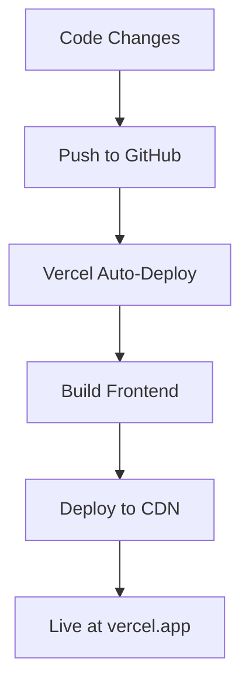

# Safe Drive - Vercel Deployment Summary

## ✅ What's Been Configured

### 1. **Vercel Configuration** (`vercel.json`)
- Build command: Builds the React frontend
- Output directory: `frontend/build`
- Rewrites configured for client-side routing
- Cache headers for static assets

### 2. **Environment Variables Setup**
- `REACT_APP_API_URL`: Point to your backend API URL
- Automatically loaded in the React app

### 3. **Files Created**
- ✅ `vercel.json` - Vercel deployment configuration
- ✅ `.vercelignore` - Files to exclude from deployment
- ✅ `package.json` - Root package.json for project structure
- ✅ `VERCEL_DEPLOYMENT.md` - Complete deployment guide
- ✅ `QUICK_DEPLOY.md` - Quick start guide
- ✅ `DEPLOYMENT_SUMMARY.md` - This file

### 4. **Backend CORS Configuration**
- Updated `app.py` with proper CORS settings
- Allows cross-origin requests from the frontend

---

## 🚀 Quick Start Deployment

### Option 1: Via Vercel Dashboard (Recommended)

1. **Push to GitHub**
   ```bash
   git add .
   git commit -m "Configure for Vercel deployment"
   git push origin main
   ```

2. **Deploy on Vercel**
   - Go to [vercel.com](https://vercel.com)
   - Sign in with GitHub
   - Click "Add New Project"
   - Import `Safe_Drive` repository
   - Vercel auto-detects settings

3. **Add Environment Variable**
   - Go to Project Settings → Environment Variables
   - Add: `REACT_APP_API_URL`
   - Value: Your backend URL (e.g., `https://your-backend.railway.app/api`)

4. **Deploy**
   - Click "Deploy"
   - Done! Your app is live

### Option 2: Via CLI

```bash
# Install Vercel CLI
npm i -g vercel

# Login
vercel login

# Deploy
vercel

# Add environment variable
vercel env add REACT_APP_API_URL

# Deploy to production
vercel --prod
```

---

## ⚠️ Important Notes

### 1. **Backend Must Be Deployed Separately**
The Flask backend cannot run on Vercel because:
- Requires webcam access (impossible on Vercel)
- Uses heavy ML libraries (OpenCV, dlib, TensorFlow)
- Needs continuous operation

**Backend Deployment Options:**
- **Railway**: Recommended (easy Python support)
- **Render**: Good alternative
- **PythonAnywhere**: Free tier available

### 2. **Camera Won't Work in Production**
The application requires:
- Webcam access (browser security restriction)
- Backend on same machine or proper WebRTC setup

**For production use:**
- Deploy frontend to Vercel ✅
- Deploy backend to Railway/Render ✅
- Camera functionality requires local backend or WebRTC implementation

### 3. **Environment Variables**
Required in Vercel dashboard:
```env
REACT_APP_API_URL=https://your-backend-url.railway.app/api
```

---

## 📁 Project Structure

```
Safe_Drive/
├── vercel.json              # ✅ Vercel configuration
├── package.json             # ✅ Root package.json
├── .vercelignore            # ✅ Files to exclude
├── frontend/                # ✅ React app (will be deployed)
│   ├── src/
│   ├── public/
│   └── package.json
├── app.py                   # ❌ Backend (not deployed to Vercel)
├── models/                  # ❌ ML models (not deployed)
└── data/                    # ❌ Data files (not deployed)
```

---

## 🔧 Configuration Details

### Build Settings (Vercel)
- **Framework**: React
- **Build Command**: `cd frontend && npm install && npm run build`
- **Output Directory**: `frontend/build`
- **Install Command**: `cd frontend && npm install`

### Routes
- All routes (`/*`) → `index.html` (React Router support)
- Static assets cached for 1 year

### Environment Variables
- `REACT_APP_API_URL`: Your backend API endpoint

---

## 🧪 Testing the Deployment

### 1. Local Testing
```bash
# Start backend locally
python app.py

# In another terminal, test frontend
cd frontend
npm start
```

### 2. Production Testing
1. Visit your Vercel URL
2. Check browser console for errors
3. Verify API calls work (even without camera)
4. Check Network tab for API responses

---

## 📊 Deployment Workflow



---

## 🔄 Updating Your App

### Automatic (Recommended)
1. Push to GitHub main branch
2. Vercel auto-deploys

### Manual
```bash
vercel --prod
```

### Force Rebuild
```bash
vercel --prod --force
```

---

## 🐛 Troubleshooting

### Build Fails
```bash
# Check logs
vercel logs

# Rebuild
vercel --prod --force
```

### Environment Variable Not Working
1. Go to Vercel Dashboard
2. Settings → Environment Variables
3. Verify variable exists
4. Redeploy

### CORS Errors
- Ensure backend CORS is configured
- Check backend URL is correct
- Verify HTTPS is enabled

### API Connection Failed
- Backend must be deployed and running
- Check backend URL in environment variable
- Verify backend accepts requests from Vercel domain

---

## 📞 Support

**Common Issues:**
1. Build fails → Check `vercel.json` syntax
2. Environment variable not found → Add in Vercel dashboard
3. API calls fail → Verify backend URL and CORS

**Resources:**
- [Vercel Docs](https://vercel.com/docs)
- See `VERCEL_DEPLOYMENT.md` for detailed guide
- See `QUICK_DEPLOY.md` for quick reference

---

## ✨ Next Steps

1. **Deploy Backend** (Railway/Render)
   - Get backend URL
   - Note the API endpoint

2. **Configure Environment Variables**
   - Add `REACT_APP_API_URL` in Vercel
   - Set to your backend URL

3. **Deploy Frontend**
   - Run `vercel` or use dashboard
   - Wait for build

4. **Test**
   - Visit Vercel URL
   - Verify UI loads
   - Check console for errors

5. **Monitor**
   - Check Vercel dashboard for logs
   - Monitor backend logs
   - Adjust as needed

---

## 🎉 Success Criteria

✅ Frontend builds successfully
✅ Environment variables configured
✅ API calls work (check Network tab)
✅ UI renders correctly
✅ No console errors

---

## 📝 Additional Notes

- Frontend is fully deployable to Vercel
- Backend requires separate hosting
- Camera functionality limited to local usage
- Consider WebRTC for remote camera access
- Production-ready CORS configuration included

**Happy Deploying! 🚀**

